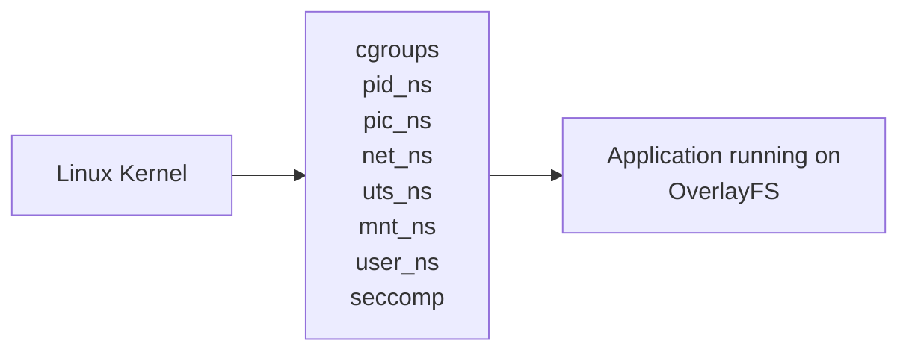

# Architecture

!!! info "Draft and Incomplete. Help us authoring by clicking the github icon."

## Fundamental



_Diagram 1: Rough Architecture of container system_

To create a container, a container image is used as stated in general. The contents of this image file are duplicated into the sandboxed environment as the root filesystem using OverlayFS and chroot. There are many strategies for mounting the root filesystem in the container, but OverlayFS is quite the common one.

In Diagram 1 above, the sandboxed container environment can be seen as the last third box. The middle box holds the kernel primitives that play the key role in container technologies and they are as follows:

| Container Primitives | Definitions                                                                                                                                                                                                                               |
| -------------------- | ----------------------------------------------------------------------------------------------------------------------------------------------------------------------------------------------------------------------------------------- |
| cgroups              | cgroup allows putting limits on a process and its children. Commonly used for limiting CPU and RAM usage. cgroups are technically optional for containers. However, you may need it in production.                                        |
| pid_ns               | The PID namespace (pid_ns) allows a process and its children to run in a new process tree that maps back to the host process tree.                                                                                                        |
| pic_ns               | The Inter-Process Communication Namespace (ipc_ns) limits the processes ability to share memory.                                                                                                                                          |
| net_ns               | The Network Namespace (net_ns) allows a new network stack to exist in the sandbox. This means our sandboxed environment can have its own network interfaces, routing tables, DNS lookup servers, IP addresses, and etc…​ you name!        |
| uts_ns               | Ironic as it is, The Unix Time Sharing Namespace (uts_ns) exists purely to isolate the system identity strings. This allows a container to assign its own hostname without conflicting with the host.                                     |
| mnt_ns               | The Mount Namespace (mnt_ns) is the part of the kernel that stores the mount table. When the sandboxed environment runs in a new Mount Namespace, it can mount filesystems not present on the host. This is very important as you’ll see. |
| user_ns              | The User Namespace (user_ns) the sandboxed environments to have its own set of user and group IDs that will map to unique user and group IDs back on the host system.                                                                     |
| seccomp              | seccomp is a utility acts as a filter for kernel calls. This allows us to drop Kernel capabilities in the sandboxed environment. Utilizing seccomp is also not strictly vital to containers.                                              |

## Unshare

The Podman container technology relies on namespaces. New Linux Namespaces are typically spawned by using either the `clone` or `unshare` system calls. These exist as C functions that have wrapper in many languages.
For using in a shell, unshare is more straight forward.

```
unshare --help
```

!!! info "When you run unshare in a shell, it does not directly executue but wraps the real unshare kernel call inside of itself."

The mnt_ns is what responsible for storing the mount table in Linux kernel. When a sandboxed environment like a container runs in a new Mount Namespace, it can mount filesystems not present on the host.

```
sudo unshare -m /bin/bash
```

```{.yaml .no-copy}
[sudo] password for localhost:
root@localhost:/var/home/localhost/# whoami
root
```

_depending on where you are using, you may need sudo._

- Unshare wraps the unshare kernel sys call.
- `-m` requests a mount new Namespace.
- `/bin/bash` tells what program to run after the mount. We ran bash thus, it gave a bash terminal

```
mount -t tmpfs tmpfs /mnt
mount | grep mnt
```

It creates a tem fs in ram and covers up the existing up one.

Now lets add something to the new /mnt

```
date > /mnt/date
cat /mnt/date
```

```{.yaml .no-copy}
Fri Sep 11 10:49:31 AM +0530 2026
```

Seems date added to /mnt ?

We can exit the name space either by closing the terminal tab or using the `exit` command.

```
exit
```

```{.yaml .no-copy}
exit
```

Now let's try reading from /mnt/date

```
cat /mnt/date
```

```{.yaml .no-copy}
cat: /mnt/date: No such file or directory
```

As it was created in a temporary mount namespace, it is gone after `exit`.
