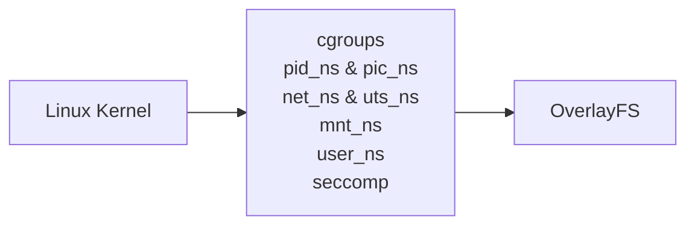

---
icon:
---

# Containers

## Introduction

<figure markdown="span">
    { width="300" }
    <figcaption>F1: Linux Container</figcaption>
</figure>

A container is a sandboxed runtime environment on Linux systems. The sandbox is constructed using the utilities present in the Linux kernel. Software running in this sandbox share the kernel with the host it is running on, but the certain aspects of kernel that store the machine state are abstracted through namespaces to allow the isolated or the container environments to have a different state than the host even though they are sharing the same kernel.

As you may or may not heard of containers in MacOS and Windows. Windows and macOS run Linux containers by using a lightweight virtual machine in the background to provide the features only Linux kernel can offer.

!!! quote "Containers in windows & MacOS"

      Windows has a fully functional container system built directly into its kernel, but it can only run Windows binaries inside a Windows namespace. Most of the times when a container referred in a windows related talk, it is almost always about Linux containers which Windows natively can't run. To overcome, it uses WSL 2.
      WSL 2, powered by a lightweight utility partition utilizing a custom linux kernel via Hyper-V maintained by Microsoft. It creates a single virtual disk called ext.vhdx into which a standard linux ext4 filesystem lives. Don't be mistaken that it only works with ex4. It can also work with other linux filesystems and ext4 is what it defaults to.

      Apple has its developer tool called container. It allows Mac users to create and run Linux containers using lightweight virtual machines on MacOS without needing for a third party. However, Unlike Windows which offers its own container system along with WSL, MacOS only offers Linux Container Utilities.

The contents of the filesystem are typically provided by an image file and the environment exists as a chroot process in the filesystem. The network stack inside the container is constructed with the Linux network stack primitives to share a connection with the host without worrying about conflicting port numbers.

Containers should aim to preserve the normal system interface while changing what resources the software can see and access in a way that the software running in the sandbox should not recognize it is in a sandbox. The The software should run just as it would run natively on a host.

??? note "Sometimes, some programs deliberately try to find whether they are running inside an isolated environment."

    It can have legitimate purposes such as

      1. diagnostics

      2. compatibility

      3. virtualization management

      4. security software

    But malware can also do this to determine whether it is in a sandbox.

## Architecture

_F2: Rough Architecture of container system_

In F2 above, the sandboxed container environment can be seen as the last third box. The middle box holds the Kernel Namespaces and they are as follows:
