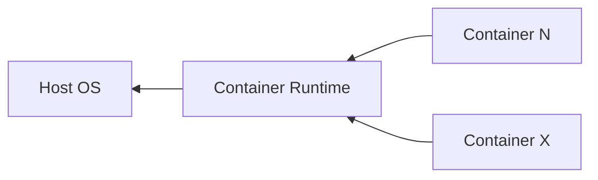

---
icon:
---

# Linux Containers

## Introduction

<figure markdown="span">
    { width="600" }
</figure>

A container is a sandboxed runtime environment on Linux systems. The sandbox is constructed using the utilities present in the Linux kernel. Software running in this sandbox share the kernel with the host it is running on, but the certain aspects of kernel that store the machine state are abstracted through namespaces to allow the isolated or the container environments to have a different state than the host even though they are sharing the same kernel.

As you may or may not heard of containers in MacOS[^1] and Windows[^2]. Windows and macOS run Linux containers by using a lightweight virtual machine in the background to provide the features only Linux kernel can offer.

The contents of the filesystem are typically provided by an image file and the environment exists as a chroot process in the filesystem. The network stack inside the container is constructed with the Linux network stack primitives to share a connection with the host without worrying about conflicting port numbers.

Containers should aim to preserve the normal system interface while changing what resources the software can see and access in a way that the software running in the sandbox should not recognize it is in a sandbox. The The software should run just as it would run natively on a host.

??? info "Sometimes, some programs deliberately try to find whether they are running inside an isolated environment."

    It can have legitimate purposes such as

      1. diagnostics

      2. compatibility

      3. virtualization management

      4. security software

    But malware can also do this to determine whether it is in a sandbox.

## Architecture



A Container Runtime sits between the containers and the host. It uses the primitives found on the host to create the containers. Detailed architecture is available at [
Containers Architecture](../architecture)

## Containers, images, and registries

!!! info

    The Open Container Initiative (OCI) is an open governance structure for the express purpose of creating open industry standards around container formats and runtimes.

| OCI Terms     | Definitions                                                                                               |
| ------------- | --------------------------------------------------------------------------------------------------------- |
| Image[^1]     | An OCI image / a container image, is a read-only template with instructions for creating a container.     |
| Container[^2] | A runnable instance of an image.                                                                          |
| Registry[^3]  | A centralized system for storing, managing, and distributing container images and OCI compliant artifacts |

To create a container, a container image is used.

??? tip "The Container Story"

     This is, in a nutshell, the story[^2].

    ```mermaid
    quadrantChart
        x-axis First Movers --> Second Movers
        y-axis New Tech --> Known Tech
        quadrant-1 Depends
        quadrant-2 No risk but rewarding
        quadrant-3 Riskiest & most rewarding
        quadrant-4 Depends
        Podman: [0.3, 0.6]
        Flinch: [0.57, 0.69]
        Rkt: [0.78, 0.34]
        Docker: [0.40, 0.34]
    ```

    Old technology is determined by the new technology's underlying primitives that were matured/standardized as time went.

    Depends: _First Mover ∝ 1 / Second Mover_ . If first mover was great and self-contained enough, the second one wouldn't have had the chance.

    Note: This is not a scientifically validaded statement, but a rhetorial theory.

[^1]: Apple has its developer tool called container. It allows Mac users to create and run Linux containers using lightweight virtual machines on MacOS without needing for a third party. However, MacOS only offers Linux Container Utilities. There's no Mac containers.

[^2]: Windows has a fully functional container system built directly into its kernel, but it can only run Windows binaries inside a Windows namespace. A container in a Windows is almost always about Linux containers which Windows natively can't run. To overcome, it uses WSL 2. WSL 2, powered by a lightweight utility partition developed on a custom linux kernel via Hyper-V maintained by Microsoft. It creates a single virtual disk called ext.vhdx into which a standard linux ext4 filesystem lives. It can also work with other Linux filesystems but, ext4 is what it defaults to.

[^3]: An image doesn't necessarily mean it's built from ground up. Often, an image is based on another image, with some additional customization.

[^4]: You can create, start, stop, move, or delete a container. You can also connect a container to one or more networks, attach storage to it, or even create a new image based on its current state (aka commit).

[^5]: Common container registries are Docker Hub and Quay.io
