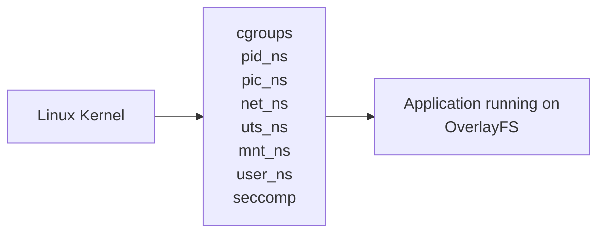

# Containers Architecture

!!! info "Note"

    To use and manage containers, you do not need to learn about the underlying architecture. You may start from [Work With Containers](../work-with-containers), fully omitting the architecture side.

## Prequisites

Ensure you have read and understood [General](../general/).

Ensure you can use the [Glossaries](../general/glossary) from general to look after foreign terms.

## Fundamental

_Diagram 1: Rough Architecture of container system_

To create a container, a container image is used as stated in general. The contents of this image file are duplicated into the sandboxed environment as the root filesystem using OverlayFS and chroot. There are many strategies for mounting the root filesystem in the container, but OverlayFS is quite the common one.

In Diagram 1 above, the sandboxed container environment can be seen as the last third box. The middle box holds the kernel primitives that play the key role in container technologies and they are as follows:

| Container Primitives | Definitions                                                                                                                                                                                                                               |
| -------------------- | ----------------------------------------------------------------------------------------------------------------------------------------------------------------------------------------------------------------------------------------- |
| cgroups              | cgroup allows putting limits on a process and its children. Commonly used for limiting CPU and RAM usage. cgroups are technically optional for containers. However, you may need it in production.                                        |
| pid_ns               | The PID namespace (pid_ns) allows a process and its children to run in a new process tree that maps back to the host process tree.                                                                                                        |
| pic_ns               | The Inter-Process Communication Namespace (ipc_ns) limits the processes ability to share memory.                                                                                                                                          |
| net_ns               | The Network Namespace (net_ns) allows a new network stack to exist in the sandbox. This means our sandboxed environment can have its own network interfaces, routing tables, DNS lookup servers, IP addresses, and etc…​ you name!        |
| uts_ns               | Ironic as it is, The Unix Time Sharing Namespace (uts_ns) exists purely to isolate the system identity strings. This allows a container to assign its own hostname without conflicting with the host.                                     |
| mnt_ns               | The Mount Namespace (mnt_ns) is the part of the kernel that stores the mount table. When the sandboxed environment runs in a new Mount Namespace, it can mount filesystems not present on the host. This is very important as you’ll see. |
| user_ns              | The User Namespace (user_ns) the sandboxed environments to have its own set of user and group IDs that will map to unique user and group IDs back on the host system.                                                                     |
| seccomp              | seccomp is a utility acts as a filter for kernel calls. This allows us to drop Kernel capabilities in the sandboxed environment. Utilizing seccomp is also not strictly vital to containers.                                              |
